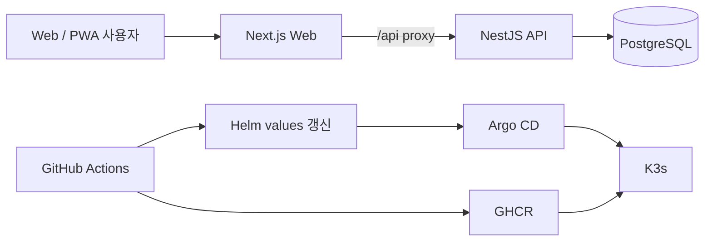

# 💩 Poo Diary

> 일상의 배변 기록을 통해 건강 패턴을 가볍고 꾸준하게 관리하는 PWA 서비스

[서비스 바로가기](https://poo-diary.mercury-lab.uk)

Poo Diary는 브리스톨 대변 형태 척도를 기반으로 배변 상태와 식단, 통증 여부를
기록하고 기간별 패턴을 확인할 수 있는 풀스택 웹 애플리케이션입니다. 모바일에서
매일 부담 없이 사용할 수 있도록 설치 가능한 PWA로 구현했습니다.

## 주요 기능

- **간편한 배변 기록** — 브리스톨 유형, 색상, 통증 정도, 식단과 메모 입력
- **개인별 기록 관리** — 브라우저에서 생성한 사용자 식별자를 기준으로 기록 분리
- **건강 패턴 분석** — 일·주·월 단위 통계와 식단별 배변 상태 상관관계 제공
- **모바일 사용성** — 반응형 UI, 홈 화면 설치와 오프라인 캐시를 지원하는 PWA
- **타입 안정성** — Web과 API가 DTO 및 도메인 타입을 workspace 패키지로 공유

## 기술 스택

| 영역 | 기술 |
| --- | --- |
| Frontend | Next.js 15, React 19, TanStack Query 5, Axios, Tailwind CSS |
| PWA | next-pwa, Service Worker, Web App Manifest |
| Backend | NestJS 10, Fastify, TypeORM, class-validator |
| Database | PostgreSQL 16 |
| Monorepo | pnpm workspaces, Turborepo, TypeScript |
| Delivery | Docker, GitHub Actions, GHCR, Helm, Argo CD, K3s |

## 아키텍처



프론트엔드와 백엔드는 독립된 컨테이너로 실행하지만 하나의 Helm 차트와 Argo CD
Application으로 배포합니다. 브라우저의 `/api` 요청은 Web 서버를 통해 클러스터
내부 API Service로 전달되므로 외부에는 하나의 진입점만 노출됩니다.

## 프로젝트 구조

```text
poo-diary/
├── apps/
│   ├── web/                 # Next.js App Router 기반 PWA
│   └── api/                 # NestJS + Fastify REST API
├── packages/
│   └── shared/              # DTO, 도메인 타입 및 공통 상수
├── .github/workflows/       # 이미지 빌드 및 GitOps 자동화
├── docker-compose.yml       # 로컬 PostgreSQL
├── pnpm-workspace.yaml
└── turbo.json
```

## 설계 포인트

### 공유 타입 기반 모노레포

`@poo-diary/shared` 패키지에서 `DiaryEntry`, 생성·수정 DTO, 브리스톨 유형과
식단 상수를 관리합니다. Web과 API가 동일한 계약을 사용하여 중복 선언과 타입
불일치를 줄였습니다.

### 서버 상태와 사용자 경험

TanStack Query로 조회 캐시와 mutation 이후 무효화를 관리합니다. PWA 캐시는
정적 자산과 네트워크 요청의 성격에 따라 분리해 모바일 환경의 재방문 속도와
연결 안정성을 높였습니다.

### GitOps 배포

`main` 브랜치가 갱신되면 GitHub Actions가 API와 Web 이미지를 동일 커밋 태그로
빌드해 GHCR에 게시합니다. 이어서 별도 Helm 저장소의 두 이미지 태그를 함께
갱신하고, Argo CD가 변경을 감지해 K3s에 자동 동기화합니다.

```text
Source push
  → API / Web image build
  → GHCR push (main-<sha7>)
  → Helm values update
  → Argo CD sync
  → K3s rollout
```

## 로컬 실행

### 요구 사항

- Node.js 20 이상
- pnpm 9
- Docker 또는 로컬 PostgreSQL 16

### 1. 저장소 준비

```bash
git clone https://github.com/uhjinkim9/poo-diary.git
cd poo-diary
pnpm install
```

### 2. PostgreSQL 실행

```bash
docker compose up -d
```

### 3. 환경 변수 설정

```bash
cp apps/api/.env.example apps/api/.env
cp apps/web/.env.local.example apps/web/.env.local
```

기본 개발 환경의 API 설정은 다음과 같습니다.

```env
PORT=3001
WEB_URL=http://localhost:3000
NODE_ENV=development
DB_HOST=localhost
DB_PORT=5432
DB_USER=postgres
DB_PASSWORD=postgres
DB_NAME=poo_diary
DB_SSL=false
```

### 4. 개발 서버 실행

```bash
pnpm dev
```

| 서비스 | 주소 |
| --- | --- |
| Web | http://localhost:3000 |
| API | http://localhost:3001 |
| Swagger | http://localhost:3001/api/docs |

개별 애플리케이션만 실행할 수도 있습니다.

```bash
pnpm --filter @poo-diary/web dev
pnpm --filter @poo-diary/api dev
```

## 품질 확인

```bash
pnpm type-check
pnpm lint
pnpm build
```

## 주요 API

| Method | Endpoint | 설명 |
| --- | --- | --- |
| `GET` | `/health` | API 상태 확인 |
| `GET` | `/diary` | 사용자의 전체 기록 조회 |
| `GET` | `/diary/:id` | 기록 상세 조회 |
| `POST` | `/diary` | 새 기록 생성 |
| `PATCH` | `/diary/:id` | 기록 수정 |
| `DELETE` | `/diary/:id` | 기록 삭제 |
| `GET` | `/diary/stats/food-correlation` | 식단별 상관관계 통계 |

사용자별 데이터 분리를 위해 Diary API 요청에는 `x-user-id` 헤더가 필요합니다.

## 브리스톨 대변 형태 척도

| 유형 | 의미 |
| --- | --- |
| 1–2 | 변비 경향 |
| 3–4 | 정상 범위 |
| 5 | 식이섬유 부족 가능성 |
| 6–7 | 설사 경향 |

> 이 서비스의 분석 결과는 일상적인 건강 기록을 돕기 위한 정보이며 의료 진단을
> 대신하지 않습니다.
